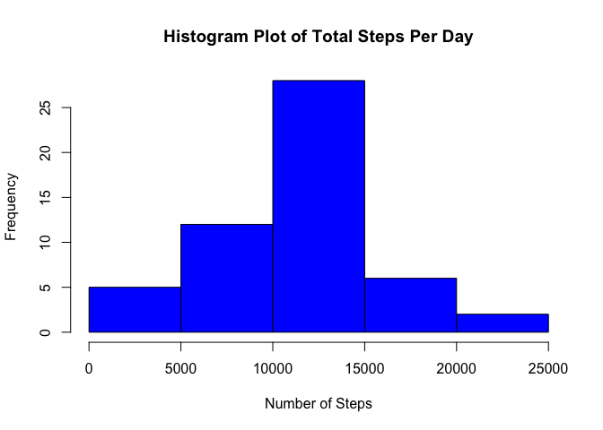
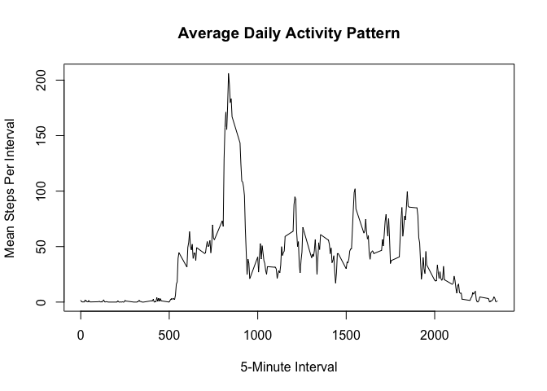
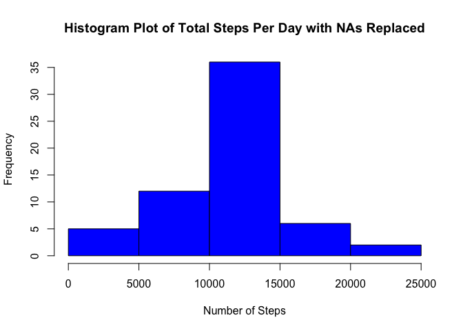
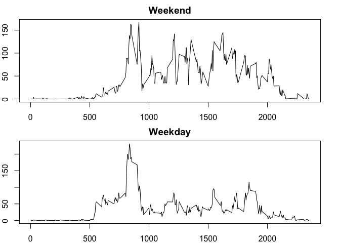

# Course Project 1
John McConnell  
June 29, 2016  

#Introduction

It is now possible to collect a large amount of data about personal movement using activity monitoring devices such as a Fitbit, Nike Fuelband, or Jawbone Up. These type of devices are part of the “quantified self” movement – a group of enthusiasts who take measurements about themselves regularly to improve their health, to find patterns in their behavior, or because they are tech geeks. But these data remain under-utilized both because the raw data are hard to obtain and there is a lack of statistical methods and software for processing and interpreting the data.

This assignment makes use of data from a personal activity monitoring device. This device collects data at 5 minute intervals through out the day. The data consists of two months of data from an anonymous individual collected during the months of October and November, 2012 and include the number of steps taken in 5 minute intervals each day.

The variables included in this dataset are:

+ **steps**: Number of steps taking in a 5-minute interval (missing values are coded as 𝙽𝙰)
+ **date**: The date on which the measurement was taken in YYYY-MM-DD format
+ **interval**: Identifier for the 5-minute interval in which measurement was taken

The dataset is stored in a comma-separated-value (CSV) file and there are a total of 17,568 observations in this dataset.

**Load and preprocess the data**

Read in the data file and convert the date from factor to date format.


```r
activity_data <- read.csv("./data/activity.csv")
activity_data$date <- as.Date(as.character(activity_data$date))
```

**What is the mean total number of steps taken per day?**

Calculate the total number of steps taken per day...  

First, group the number of steps by the date.  Then summarize to find the answer.


```r
library(dplyr)
```

```
## 
## Attaching package: 'dplyr'
```

```
## The following objects are masked from 'package:stats':
## 
##     filter, lag
```

```
## The following objects are masked from 'package:base':
## 
##     intersect, setdiff, setequal, union
```

```r
by_date <- group_by(activity_data, date)
steps_by_day <- summarize(by_date, total=sum(steps))
steps_by_day
```

```
## Source: local data frame [61 x 2]
## 
##          date total
##        (date) (int)
## 1  2012-10-01    NA
## 2  2012-10-02   126
## 3  2012-10-03 11352
## 4  2012-10-04 12116
## 5  2012-10-05 13294
## 6  2012-10-06 15420
## 7  2012-10-07 11015
## 8  2012-10-08    NA
## 9  2012-10-09 12811
## 10 2012-10-10  9900
## ..        ...   ...
```

Calculate the mean total number of steps taken per day...


```r
mean_steps_by_day <- summarize(by_date, mean(steps))
mean_steps_by_day
```

```
## Source: local data frame [61 x 2]
## 
##          date mean(steps)
##        (date)       (dbl)
## 1  2012-10-01          NA
## 2  2012-10-02     0.43750
## 3  2012-10-03    39.41667
## 4  2012-10-04    42.06944
## 5  2012-10-05    46.15972
## 6  2012-10-06    53.54167
## 7  2012-10-07    38.24653
## 8  2012-10-08          NA
## 9  2012-10-09    44.48264
## 10 2012-10-10    34.37500
## ..        ...         ...
```

Display a histogram of the total number of steps taken each day


```r
hist(steps_by_day$total, pch=20, col="blue", xlab="Number of Steps", ylab="Frequency",main="Histogram Plot of Total Steps Per Day")
```

<!-- -->

Now sumarize the data so we know min, median, mean, and max


```r
summary(steps_by_day)
```

```
##       date                total      
##  Min.   :2012-10-01   Min.   :   41  
##  1st Qu.:2012-10-16   1st Qu.: 8841  
##  Median :2012-10-31   Median :10765  
##  Mean   :2012-10-31   Mean   :10766  
##  3rd Qu.:2012-11-15   3rd Qu.:13294  
##  Max.   :2012-11-30   Max.   :21194  
##                       NA's   :8
```

**What is the average daily activity pattern?**

Make a time series plot (i.e. 𝚝𝚢𝚙𝚎 = "𝚕") of the 5-minute interval (x-axis) and the average number of steps taken, averaged across all days (y-axis).

Which 5-minute interval, on average across all the days in the dataset, contains the maximum number of steps?


```r
by_interval <- group_by(activity_data, interval)
by_interval_means <- summarize(by_interval, mean=mean(steps, na.rm=TRUE))
by_interval_means
```

```
## Source: local data frame [288 x 2]
## 
##    interval      mean
##       (int)     (dbl)
## 1         0 1.7169811
## 2         5 0.3396226
## 3        10 0.1320755
## 4        15 0.1509434
## 5        20 0.0754717
## 6        25 2.0943396
## 7        30 0.5283019
## 8        35 0.8679245
## 9        40 0.0000000
## 10       45 1.4716981
## ..      ...       ...
```

Create the plot


```r
plot(by_interval_means$interval, by_interval_means$mean, type="l",xlab="5-Minute Interval",ylab = "Mean Steps Per Interval", main="Average Daily Activity Pattern")
```

<!-- -->

Which interval had the highest average steps?


```r
by_interval_means[which.max(by_interval_means$mean),]
```

```
## Source: local data frame [1 x 2]
## 
##   interval     mean
##      (int)    (dbl)
## 1      835 206.1698
```

**Inputing missing values**

Report on the total number of missing values in the dataset


```r
missing_values <- is.na(activity_data$steps)
sum(missing_values)
```

```
## [1] 2304
```

Fill in missing values for steps to be the mean steps for the interval


```r
activity_data_replaced <- activity_data
num_replaced <- 0
for (index in 1:nrow(activity_data_replaced)) {
        if (is.na(activity_data_replaced[index,]$steps)) {
                est_val <- by_interval_means[by_interval_means$interval==activity_data_replaced[index,]$interval,]$mean
                activity_data_replaced[index,]$steps <- est_val
                num_replaced <- num_replaced + 1
        }
}
cat("Replaced ", num_replaced, " NA values with the interval means.")
```

```
## Replaced  2304  NA values with the interval means.
```

Take a look at activity_data_replaced


```r
head(activity_data_replaced)
```

```
##       steps       date interval
## 1 1.7169811 2012-10-01        0
## 2 0.3396226 2012-10-01        5
## 3 0.1320755 2012-10-01       10
## 4 0.1509434 2012-10-01       15
## 5 0.0754717 2012-10-01       20
## 6 2.0943396 2012-10-01       25
```

Now make a new histogram for the total number of steps taken each day.


```r
by_date_replaced <- group_by(activity_data_replaced, date)
steps_by_day_replaced <- summarize(by_date_replaced, total=sum(steps))
steps_by_day_replaced
```

```
## Source: local data frame [61 x 2]
## 
##          date    total
##        (date)    (dbl)
## 1  2012-10-01 10766.19
## 2  2012-10-02   126.00
## 3  2012-10-03 11352.00
## 4  2012-10-04 12116.00
## 5  2012-10-05 13294.00
## 6  2012-10-06 15420.00
## 7  2012-10-07 11015.00
## 8  2012-10-08 10766.19
## 9  2012-10-09 12811.00
## 10 2012-10-10  9900.00
## ..        ...      ...
```

Calculate the mean total number of steps taken per day...


```r
mean_steps_by_day_replaced <- summarize(by_date_replaced, mean(steps))
mean_steps_by_day_replaced
```

```
## Source: local data frame [61 x 2]
## 
##          date mean(steps)
##        (date)       (dbl)
## 1  2012-10-01    37.38260
## 2  2012-10-02     0.43750
## 3  2012-10-03    39.41667
## 4  2012-10-04    42.06944
## 5  2012-10-05    46.15972
## 6  2012-10-06    53.54167
## 7  2012-10-07    38.24653
## 8  2012-10-08    37.38260
## 9  2012-10-09    44.48264
## 10 2012-10-10    34.37500
## ..        ...         ...
```

Display a histogram of the total number of steps taken each day


```r
hist(steps_by_day_replaced$total, pch=20, col="blue", xlab="Number of Steps", ylab="Frequency",main="Histogram Plot of Total Steps Per Day with NAs Replaced")
```

<!-- -->

Now sumarize the data so we know min, median, mean, and max


```r
summary(steps_by_day_replaced)
```

```
##       date                total      
##  Min.   :2012-10-01   Min.   :   41  
##  1st Qu.:2012-10-16   1st Qu.: 9819  
##  Median :2012-10-31   Median :10766  
##  Mean   :2012-10-31   Mean   :10766  
##  3rd Qu.:2012-11-15   3rd Qu.:12811  
##  Max.   :2012-11-30   Max.   :21194
```

**Are there differences in activity patterns between weekdays and weekends?**


```r
library(chron)
activity_data_replaced[,"weekend_factor"] <- is.weekend(activity_data_replaced$date)
str(activity_data_replaced)
```

```
## 'data.frame':	17568 obs. of  4 variables:
##  $ steps         : num  1.717 0.3396 0.1321 0.1509 0.0755 ...
##  $ date          : Date, format: "2012-10-01" "2012-10-01" ...
##  $ interval      : int  0 5 10 15 20 25 30 35 40 45 ...
##  $ weekend_factor: logi  FALSE FALSE FALSE FALSE FALSE FALSE ...
```

```r
table(activity_data_replaced$weekend_factor)
```

```
## 
## FALSE  TRUE 
## 12960  4608
```

Make a panel plot containing a time series plot (i.e. type="l") of the 5-minute interval (x-axis)
and the average number of steps taken, averaged across all weekday days or weekend days(y-axis).


```r
weekend_data <- subset(x=activity_data_replaced, activity_data_replaced$weekend_factor)
weekday_data <- subset(x=activity_data_replaced, !activity_data_replaced$weekend_factor)
 
head(weekend_data)
```

```
##      steps       date interval weekend_factor
## 1441     0 2012-10-06        0           TRUE
## 1442     0 2012-10-06        5           TRUE
## 1443     0 2012-10-06       10           TRUE
## 1444     0 2012-10-06       15           TRUE
## 1445     0 2012-10-06       20           TRUE
## 1446     0 2012-10-06       25           TRUE
```

```r
head(weekday_data)
```

```
##       steps       date interval weekend_factor
## 1 1.7169811 2012-10-01        0          FALSE
## 2 0.3396226 2012-10-01        5          FALSE
## 3 0.1320755 2012-10-01       10          FALSE
## 4 0.1509434 2012-10-01       15          FALSE
## 5 0.0754717 2012-10-01       20          FALSE
## 6 2.0943396 2012-10-01       25          FALSE
```

Now generate means for the two datasets by day and generate the plots


```r
ts1 <- tapply(weekend_data$steps, weekend_data$interval, mean)
ts2 <- tapply(weekday_data$steps, weekday_data$interval, mean)
par(mfcol=c(2,1), mar=c(2,2,2,2))
plot(x=row.names(ts1), y=ts1, type="l",xlab="Interval",ylab="Number of Steps",main="Weekend")
plot(x=row.names(ts2), y=ts2, type="l",xlab="Interval",ylab="Number of Steps",main="Weekday")
```

<!-- -->


